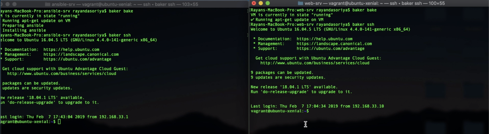
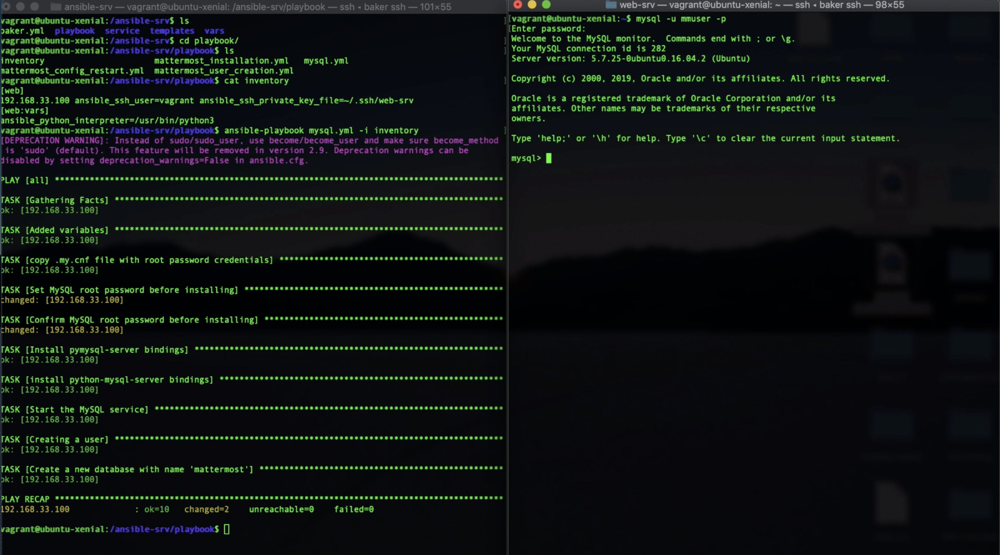
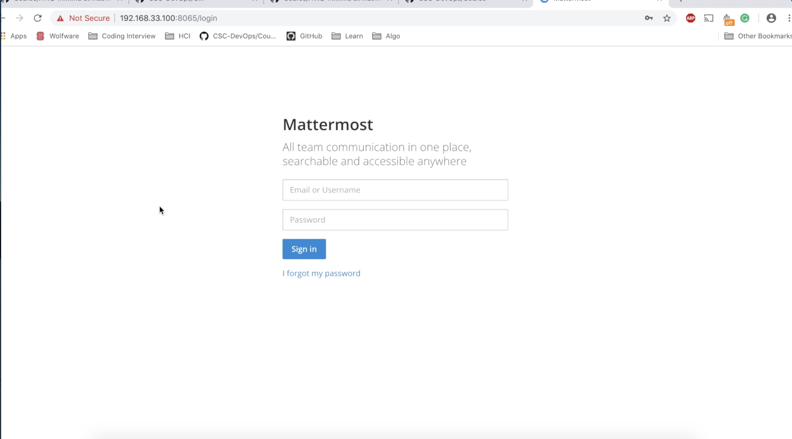
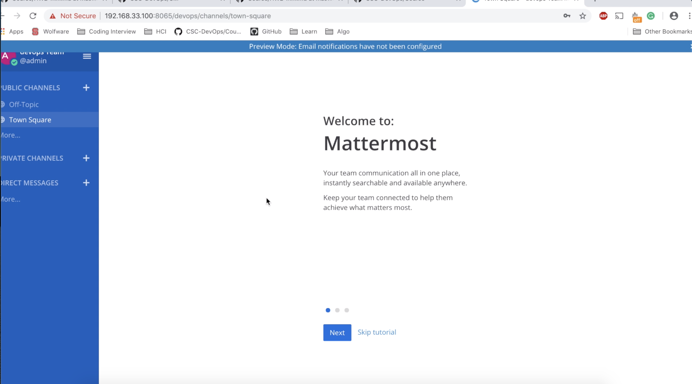
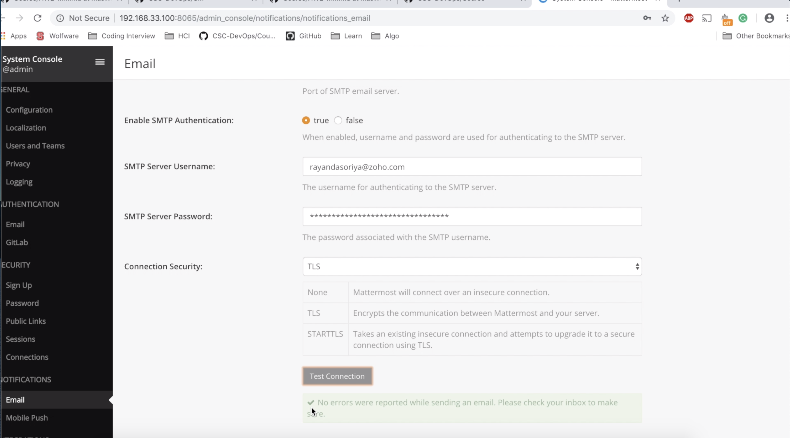

# CSC519-DevOps
## HW2

This repository contains the code to automatically configure a web server running [Mattermost](https://mattermost.com/) using Ansible. To perform the task, we have started by creating two servers running Ubuntu 16.04 with Ansible configured on one of them. After configuring Ansible, we made an SSH connection between the two servers. This connection was used to perform operations on the web server using the Ansible server. After that, I have installed MySQL Database server and Mattermost server. One admin and user have been created as the users of Mattermost server. The configuration of the server was done as the last stage of the project. this configuration included email notifications and storage options. For email confirmation, I have used [Zoho mail](https://www.zoho.com/mail/).


### Setup Instructions 

Clone the repository by ```git clone https://github.ncsu.edu/rdasori/HW2-DevOps.git```

#### System Setup

##### The configuration server

Create a configuration server. This server will be using a "push-based model", where we will be sending configuration commands to other external servers. It also needs to be configured with Ansible.

Create a Virtual Machine.

```bash
$ cd servers/ansible-srv
$ baker bake
```

##### The web server

Create another virtual machine for the web server. 

```bash
$ cd servers/web-srv
$ baker bake
```

##### Creating a connection between your servers

Create a new public/private key pair from the host machine by running the following command.

    ssh-keygen -t rsa -b 4096 -C "web-srv" -f web-srv

After generating the keys, you need to copy them onto the servers. The private key will be sent over to the configuration server. The public key will be sent over to the web-server.

##### Setting up the private key

Go to the ansible-srv (`cd servers/ansible-srv`, then `baker ssh`).

Using a file editor, paste and store your private key in a file:

```bash
ansible-srv $ vim ~/.ssh/web-srv
ansible-srv $ chmod 600 ~/.ssh/web-srv
```

##### Setting up the public key

Go inside the web-srv. Copy the web-srv.pub file from your host.

```bash
web-srv $ vim ~/.ssh/authorized_keys
```

##### Testing your connection/Errors

Inside the ansible-srv, test your connection between the servers:

    ssh -i ~/.ssh/web-srv vagrant@192.168.33.100
This completes the basic configuration of Ubuntu on both the servers with ansible configured on one of them.




#### Setting up MySQL Database Server
Go to ansible-srv/playbook and run ```ansible-playbook mysql.yml -i inventory```.
It will install the MySQL database server and will also set up the mmuser. It will also install install all the required dependencies such as pip, pip3 and jq.



#### Setting up Mattermost Server
Go to ansible-srv/playbook and run ```ansible-playbook mattermost_installation.yml -i inventory```.
It will install the mattermost server. If everything goes perfectly. We can see the webpage on 192.168.33.100:8065.



#### Configuring Mattermost Server
Go to ansible-srv/playbook and run ```ansible-playbook mattermost_user_creation.yml -i inventory```.
It will create a team, an admin and a user and will also add them to the team. We can log in to the system by using the following credentials. This step has been made idempotent. Once a team has been created, it will not create the same team again.

* For admin:
Username: admin@example.com
Password: Password

* For the user:
Username: user@example.com
Password: Password



#### Setting up email notifications
As the last step to set up the email, I have created a temporary account at Zoho and have added the SMTP connection among my server.
Complete the email notification step by running ```ansible-playbook mattermost_config_restart.yml -i inventory```. This will edit the configuration of the email notification. After that, it will restart the server so that we can see the changes made.
*If you want to set up the SMTP connection, go to vars/vars.yml and edit the SMTPUsername and SMTPPassword if you are using Zoho. If you are using some other SMTP, then configure the SMTPServer and SMTPPort as well. The credentials have also been removed from the current system.*



### Best Practices Used:
* Introduced modularity in the code by dividing the code into small logical working modules.
* Used vault to store the sensitive data as a separate file.

### Screencast
The link for screencast is available [here](https://drive.google.com/file/d/15eTNa-jmzmBdxyA640LarLGeUtepemoA/view?usp=sharing).

### References
1. https://github.com/CSC-DevOps/CM
2. https://github.com/CSC-DevOps/Course/blob/master/HW/HW2-mm.md
3. https://docs.ansible.com/
4. https://docs.mattermost.com/install/install-ubuntu-1604.html
